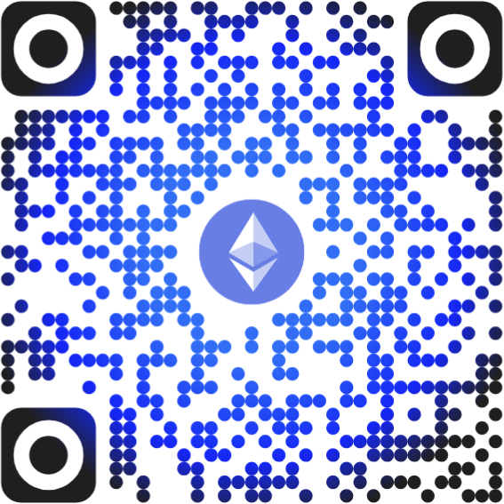

# Me faire un don

## GitHub Sponsors

Pour l'instant, le moyen le plus simple de me faire un don est via **GitHub Sponsors** ici : **[https://github.com/sponsors/MarioSwitch](https://github.com/sponsors/MarioSwitch)**

- Possibilité de faire un don unique ou mensuel
- Montant de 1 à 12 000 $ (entier uniquement)
- Badge sur votre profil GitHub
- Pas de commission pour les particuliers, jusqu'à 6 % pour les organisations

## Cryptomonnaies

Si vous possédez un portefeuille de cryptomonnaies, vous pouvez également l'utiliser pour me faire un don.



Toutes les cryptomonnaies sont autorisées (du moment qu'elles existent sur au moins un des réseaux EVM).\
Si vous ne voulez pas être exposés à la volatilité des marchés, utilisez des *stablecoins* adossés au Dollar américain (USDT, USDC...) ou à l'Euro (EURC).

Mon nom d'utilisateur est **marioswitch2020.cb.id** (0x8bC0...c213[^1]).

## Notes

[^1]: L'adresse complète est masquée pour éviter le botting. Les caractères affichés permettent de vérifier votre saisie et/ou la lecture du code QR.