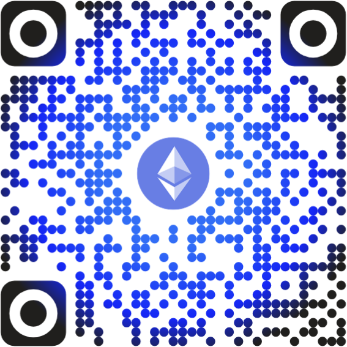

# Me faire un don

## GitHub Sponsors

Pour l'instant, le moyen le plus simple de me faire un don est via **GitHub Sponsors** ici : **[https://github.com/sponsors/MarioSwitch](https://github.com/sponsors/MarioSwitch)**

- Possibilité de faire un don unique ou mensuel
- Montant de 1 à 12 000 $ (entier uniquement)
- Badge sur votre profil GitHub
- Pas de commission pour les particuliers, jusqu'à 6 % pour les organisations

## Cryptomonnaies

Vous pouvez également me faire un don en cryptomonnaies.



- Pas de liste précise de cryptomonnaies autorisées. Privilégiez tout de même les ***stablecoins***, comme l'**USDC** (adossé au Dollar américain) ou l'**EURC** (adossé à l'Euro).
- Pas de liste précise de réseaux/protocoles autorisés. Privilégiez tout de même les ***réseaux EVM à bas coût***, comme **Base**.
- Privilégiez les combinaisons cryptomonnaie-réseau déjà existantes sur mon portefeuille. De cette manière, les totaux sont regroupés et déplaçables en une seule transaction. Vous devriez déjà voir 2 USDC et 2 EURC sur Base comme montant de départ.

Mon nom d'utilisateur est **marioswitch2020.cb.id** / **marioswitch2020.uni.eth** (0x8bC0...c213).

