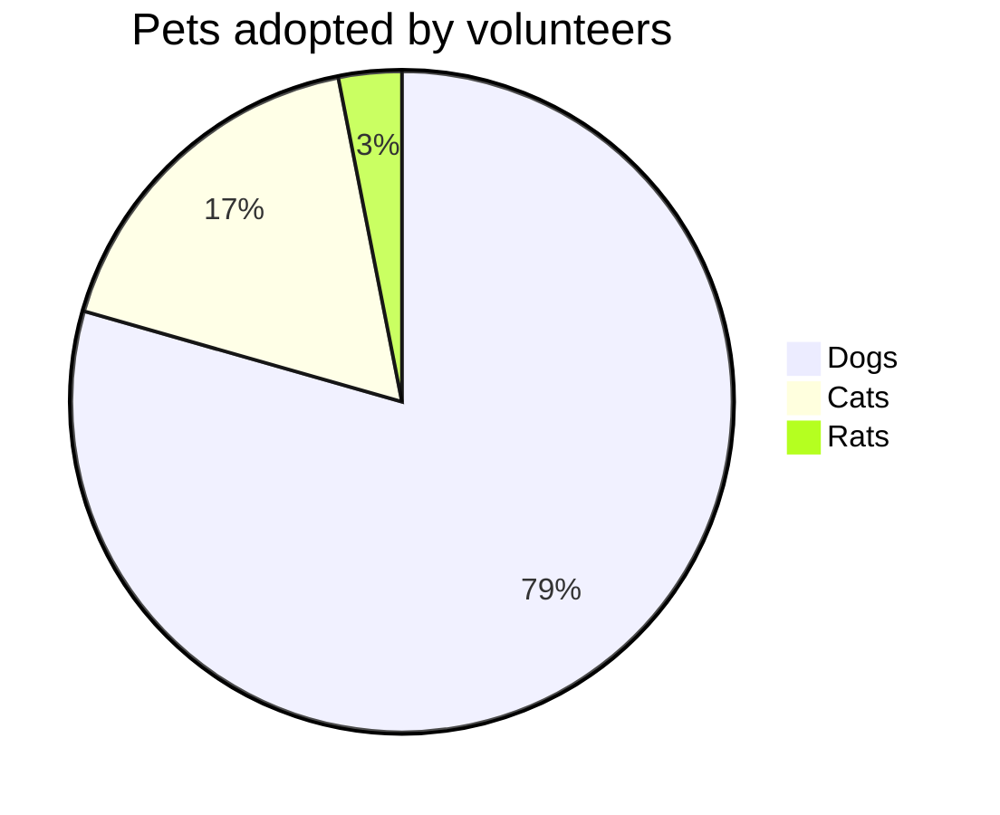

# Parcheesi











> [!NOTE]
> Cette page n'a pas été mise à jour depuis le xx/xx/xxxx et peut donc contenir des informations erronées.

1. [Co](#co)
2. [Vocabulaire](#vocabulaire)
3. [Rflflf](#rflflf)
    1. [Rflflf](#rflflf-1)
    2. [Rflflf](#rflflf-2)

Il existe de multiples variantes du Parcheesi.\
Cette page ne concerne que la [version Mundijeux](https://www.mundijeux.fr/multijoueur/parcheesi/) de ce jeu.\
Par conséquent, ces règles peuvent différer de celles écrites sur d'autres sites/règlements.

## Co
fff
## Vocabulaire

## Rflflf

### Rflflf

### Rflflf

Test[^1]

| fffffff | ffffffff |
| ------: | :------: |
|    test |   fff    |

[^1]: fff